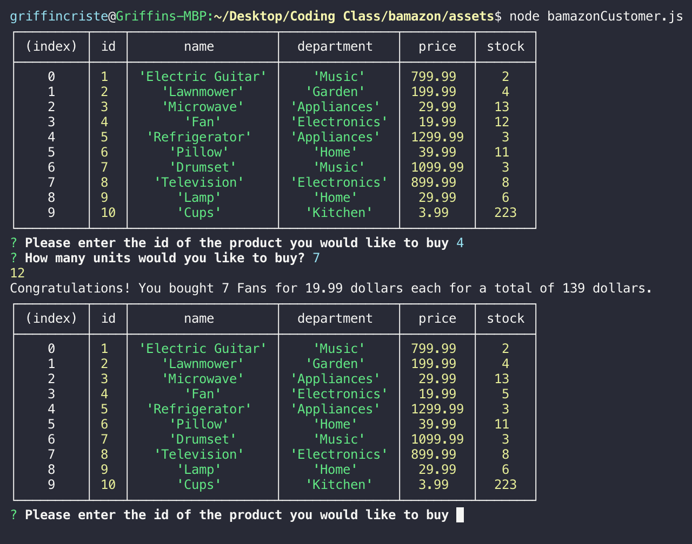

# Bamazon-App

1. This App is designed to act as an amazon-like storefront that updates the inventory of an item after a purchase is made

2. This app is first designed by running the node bamazonCustomer.js file
    -A table is displayed showing the id, the item, the price and the stock quantity.
    -The user is then asked to type in the id of the item they would like to purchase
    -If the user enters an incorrect id, an error will be shown
    -Then the user is asked how many of that item they would like to purchase
    -If the user enters an amount more than the current stock quantity, an error occurs
    -If the user enters an amount less than the current stock quantity, than that number is subtracted from the database stock quantity
    -A message is shown with the total price

3. The user inputs the id of the item
    -the item id is matched to the id number in the mysql database
    -the number of items is purchased by user
    -the stock quantity is subtracted from the mysql database
    -the table is updated
    -the app starts over

4.Link to screenshots: 

5. link : https://gcriste.github.io/Bamazon-/

6. technologies
    Javascript, node, inquirer

7. I am  the sole creator and developer of this app