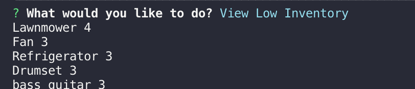

# Bamazon-App

1. This App is designed to act as an amazon-like storefront from two different user perspectives(the customer and manager) 
    -if selected as customer, it will update the inventory of an item after a purchase is made
    -if selected as manager, it will ask the user for a series of managerial options

### Customer Perspective
2.A This app is first designed by running the node bamazonCustomer.js file
    -A table is displayed showing the id, the item, the price and the stock quantity
    -The user is then asked to type in the id of the item they would like to purchase
    -If the user enters an incorrect id, an error will be shown
    -Then the user is asked how many of that item they would like to purchase
    -If the user enters an amount more than the current stock quantity, an error occurs
    -If the user enters an amount less than the current stock quantity, than that number is subtracted from the database stock quantity
    -A message is shown with the total price

### Manager Perspective
2.B  This app is first run by the command node bamazongManager.js
    -A list of options appears asking the user if they want to:
        1.View Products for Sale
        2.View Low Inventory
        3.Add to Inventory
        4.Add New Product
    -If the user selects view products for sale, a table is displayed showing the user the id, name, department, price and stock of the products stored in the products table database 
    -If the user selects view low inventory, the items with less than 5 in stock will be shown
    -If the user selects add to inventory, the user is then asked to select which item and how many they would like to add to the current stock
    -If the user selects add new product, the user is asked to type in the name, department, price and stock of the new item 

3. The information is stored in a table inside a mysql database. Any time information is updated by the user, the table is automatically updated as well

4.Link to screenshots: 
### Customer Perspective

### Manager Perspective

5. link : https://gcriste.github.io/Bamazon-/

6. technologies
    Javascript, node, inquirer, mysql

7. I am  the sole creator and developer of this app